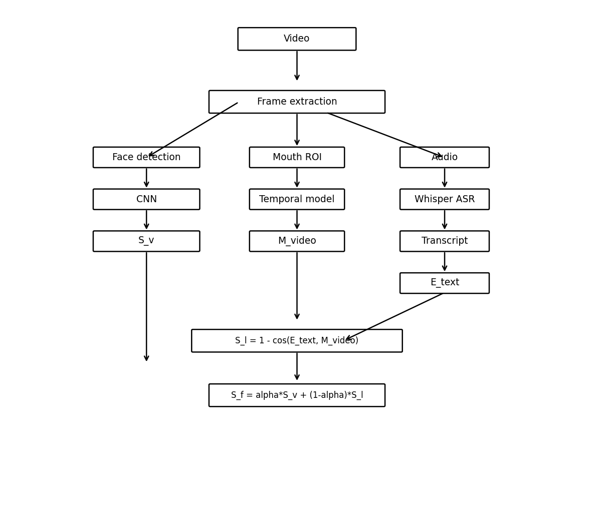

# Deepfake TR Project

**Türkçe konuşma–dudak–görüntü tutarlılığına dayalı multimodal deepfake analizi.**  
Görsel sahtecilik, konuşma içeriği ve dudak hareketlerini birlikte inceleyen, makale odaklı uçtan uca bir araştırma projesi.



> **Amaç:** Yüksek skor alan bir “ürün” çıkarmaktan çok, **konuşma–dudak–görüntü tutarlılığını aynı anda modelleyip, neden zor bir problem olduğunu deneysel olarak göstermek** (negatif ama faydalı sonuçlar).

---

## Öne çıkanlar

- **Multimodal mimari:**  
  - **Görsel skor** \(S_v\): Yüz görüntülerinden sahtecilik analizi  
  - **Senkron skor** \(S_l\): Konuşma içeriği (LLM embedding) ↔ dudak artikülasyonu tutarlılığı  
  - **Füzyon skoru** \(S_f = \alpha S_v + (1-\alpha) S_l\)
- **Uçtan uca pipeline:** `preprocess → generate_fakes → build_splits → train_visual/sync/fusion → evaluate → LaTeX tablo`
- **Gerçek veri senaryosu:** AVLips + isteğe bağlı Türkçe videolar (URL listesi)
- **Makale entegrasyonu:** `paper/main_tr.tex` IEEEtran formatında; sonuç tabloları ve ablation deneyleri Python script’leri ile otomatik güncelleniyor.

Makale yol haritası ve deney planı: **[docs/PAPER_ROADMAP.md](docs/PAPER_ROADMAP.md)**  
Pipeline formatı: **[docs/PIPELINE.md](docs/PIPELINE.md)**

---

## Kurulum

**1. Proje klasörüne gir:**

```bash
cd deepfake_tr_project
pip install -r requirements.txt
```

Windows PowerShell’de:

```powershell
cd C:\Users\busra\Desktop\df_llm\deepfake_tr_project
pip install -r requirements.txt
```

Opsiyonel ekler (bazı senaryolar için):

- `soundfile`, `openai-whisper`, `ffmpeg`, `moviepy`, `yt-dlp`

---

## Pipeline – tek bakışta

```text
data/raw_videos  +  data/raw_audio
         ↓
preprocessing
  (extract_audio, extract_frames, detect_face,
   extract_mouth_roi, transcribe_tr)
         ↓
fake generation
  (sync_shift, content_mismatch, synthetic_audio)
         ↓
data/splits (train.json, val.json, test.json)
         ↓
train visual (S_v)
→ train sync (S_l)
→ train fusion (S_f = α·S_v + (1−α)·S_l)
         ↓
evaluate (Accuracy, Precision, Recall, F1, AUC, EER)
         ↓
paper/results_table.tex + ablation tabloları
```

### Tek komutla tam pipeline (demo)

```bash
python run_pipeline.py full --demo
```

- Demo verideki yüz görselleri **tek renk placeholder** (gerçek yüz yoktur).  
- Bu komut sırayla: demo veri → sahte üretimi → split → visual/sync/fusion eğitim → test → tablo.

**Daha büyük demo seti:** 100 real + ~700 fake:

```bash
python run_pipeline.py full --demo --large
```

**Gerçek veriye geçmek** için ayrıntılı rehber:  
**[docs/GERCEK_VERI_ADIMLAR.md](docs/GERCEK_VERI_ADIMLAR.md)** ve **[docs/ADIM2_INDIRME_REHBERI.md](docs/ADIM2_INDIRME_REHBERI.md)**

### Mevcut veri ile (preprocess zaten yapıldıysa)

```bash
python run_pipeline.py full
```

İstediğin adımları atlamak için:

- `--skip-fakes`, `--skip-splits`, `--skip-train-visual`,
  `--skip-train-sync`, `--skip-train-fusion`

---

## Pipeline adımları (manuel)

| **Adım** | **Komut** |
|---------|-----------|
| Ön işleme | `python run_pipeline.py preprocess --video-list data/video_list_protocol.csv` |
| Sahte üretimi | `python run_pipeline.py generate_fakes` |
| Split (örnek bazlı / speaker-disjoint fallback) | `python run_pipeline.py build_splits` |
| Eğitim (görsel) | `python run_pipeline.py train --model visual` |
| Eğitim (senkron) | `python run_pipeline.py train --model sync --config configs/train_sync.yaml` |
| Eğitim (füzyon) | `python run_pipeline.py train --model fusion --config configs/fusion.yaml` |
| Değerlendirme | `python run_pipeline.py evaluate` |
| **Tüm modeller + tablo** | `python run_pipeline.py experiments --split test --out paper/results.json` |

---

## Gerçek videoları ekleme

**1. AVLips (hazır AV lip-sync veri seti, real+fake)**  

```bash
python scripts/add_real_videos.py avlips --download
```

- Zip indirilir, açılır, yüz/ağız ön işleme yapılır.  
- Ardından:

```bash
python run_pipeline.py generate_fakes
python run_pipeline.py build_splits
```

**2. Kendi URL listen (Türkçe videolar vb.)**

1. `data/video_urls_example.csv` dosyasını kopyalayıp kendi `data/video_urls.csv` dosyanı oluştur.  
2. `url,sample_id,speaker_id` sütunlarını kendi linklerinle doldur.  
3. Çalıştır:

```bash
python scripts/add_real_videos.py urls --csv data/video_urls.csv
python run_pipeline.py generate_fakes
python run_pipeline.py build_splits
```

Daha fazla veri seti fikri: **[docs/DATASETS.md](docs/DATASETS.md)**

---

## Veri seti şeması

- **Sınıflar:**  
  - `real_sync` – Gerçek, senkron konuşma videosu  
  - `fake_sync_shift` – Ses zamanda kaydırılmış (lip-sync hatası)  
  - `fake_content_mismatch` – Dudak hareketi ↔ içerik uyumsuz  
  - `fake_audio_synthetic` – Gerçek video + sentetik ses  
- **Önemli alanlar:** `sample_id`, `speaker_id`, `video_path`, `audio_path`, `transcript_tr`, `label_main`, `label_visual_fake`, `label_audio_fake`, `label_sync`, `sync_shift_ms`, `mismatch_type`, `faces_dir`, `mouths_dir`, …

Ayrıntılı şema: **[DATA_SPEC.md](DATA_SPEC.md)**

---

## Inference – tek örnek için skor

Eğitilmiş görsel model ile bir örneğin \(S_v\) skorunu almak için (metadata + faces hazır olmalı):

```bash
python -m src.inference.predict_video --sample-id demo_001
```

Çıktı örneği:

```text
S_v (görsel sahte olasılığı): 0.xx  (0 = gerçek, 1 = sahte)
```

Benzer şekilde, senkron ve füzyon skorları `evaluate_*` script’leri ve `run_pipeline.py evaluate` üzerinden hesaplanır.

---

## Deney sonuçları ve tablolar

Tüm modelleri **tek komutla** test edip hem konsol hem tablo + JSON almak için:

```bash
python run_pipeline.py experiments --split test --out paper/results.json
```

- Visual, Sync, Fusion sırasıyla test edilir.  
- `paper/results_table.tex` ve (LLM benchmark + ablation sonrası) `paper/ablation_alpha.tex` güncellenir.  
- Makalede doğrudan `\input{results_table}` ve `\input{ablation_alpha}` ile kullanılır.

Sadece hızlı değerlendirme için:

```bash
python run_pipeline.py evaluate
```

Elle tablo üretmek istersen:

```bash
python scripts/export_results_table.py --split test --out paper/results_table.md
python scripts/export_results_latex.py --split test --out paper/results_table.tex
python scripts/run_ablation_alpha.py --out paper/ablation_alpha.tex
```

Skor dağılımlarını görmek için:

```bash
python scripts/plot_score_histograms.py --out paper/figures/score_hist.png
```

LLM benchmark sonuçları: **[paper/llm_benchmark.md](paper/llm_benchmark.md)**  
LLM analiz notları: **[docs/LLM_BENCHMARK_NOTES.md](docs/LLM_BENCHMARK_NOTES.md)**

---

## Projenin araştırma mesajı

- **Metri̇kler:** Accuracy, Precision, Recall, F1, AUC, EER (threshold: ROC Youden, sabit 0.5 değil).  
- **Sonuçlar:** AVLips üzerinde Visual, Sync ve Fusion modelleri için AUC \(\approx 0.5\), EER \(\approx 1.0\).  
- **Yorum:** Mevcut mimari, yüksek kaliteli senaryolarda rastgele sınıflandırıcı seviyesinde kalıyor; darboğaz dudak embedding’i ve multimodal hizalamada.  
- **Katkı:** Konuşma–dudak–görüntü tutarlılığını aynı anda hedefleyen ve LLM tabanlı metin embedding’lerini dudak temsilleriyle deneysel olarak karşılaştıran uçtan uca bir çerçeve sunuyor.

Bu “negatif ama faydalı” sonuçlar, **sadece skor füzyonu yapan basit multimodal mimarilerin** modern deepfake senaryolarında neden yetersiz kaldığını pratik olarak gösteriyor ve gelecekte güçlü AV-sync backbone’ları + LLM entegrasyonu için bir başlangıç noktası sağlıyor.

---

## Dizin yapısı

- **data/** – `raw_videos`, `raw_audio`, `processed/` (faces, mouths, transcripts, metadata), `fakes/`, `splits/`
- **configs/** – `data.yaml`, `train_visual.yaml`, `train_sync.yaml`, `fusion.yaml`, demo config’ler
- **src/** – `preprocessing/`, `datasets/`, `models/`, `training/`, `inference/`, `evaluation/` (metrics, `evaluate_visual/sync/fusion`), `utils/`
- **scripts/** – pipeline yardımcı script’ler (demo data, gerçek veri, tablolar, LLM benchmark, ablation, histogramlar)
- **notebooks/** – EDA ve error analysis
- **paper/** – IEEEtran makale (`main_tr.tex`), figürler (`figures/`), sonuç tabloları (`results_*.tex`, `ablation_alpha.tex`)

